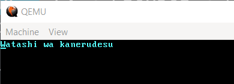

 


a project to learn how to make an OS.

## Usage
- *Frist you need to install rust nighty*

   `` rustup default nightly ``

- *then just in case we add this component to rustup*

   `` rustup component add rust-src --toolchain nightly-x86_64-pc-windows-msvc ``
   
 > by the way, I think this is only on Windows if you have another OS you can avoid this part.

- *besides that we install the bootloader dependencies 
   it can be done in two ways*:

  1--> type in the command line ` cargo add bootloader `

  2--> search what is the latest version for bootloader and write in the cargo.toml
  
  ``bootloader='LatestVersionBootloader'``

- * then you type * ` cargo install bootimage;cargo bootimage `
> remember cargo install bootimage is only for install 
>
> then you can do cargo bootimage where src/main.rs is update or not

  a .bin file will be made in the debug folder of the project
- *now with a virtual machine or booting a computer you can run it you just have to run the .bin file*

### Example

*we are using QUEMU how a vertual machine*

``` qemu-system-x86_64 -drive format=raw,file=target\x86_64\debug\bootimage-kernrust-toolchainel.bin ```

#### output


## Links
[Writing an OS in Rust](https://os.phil-opp.com/)


